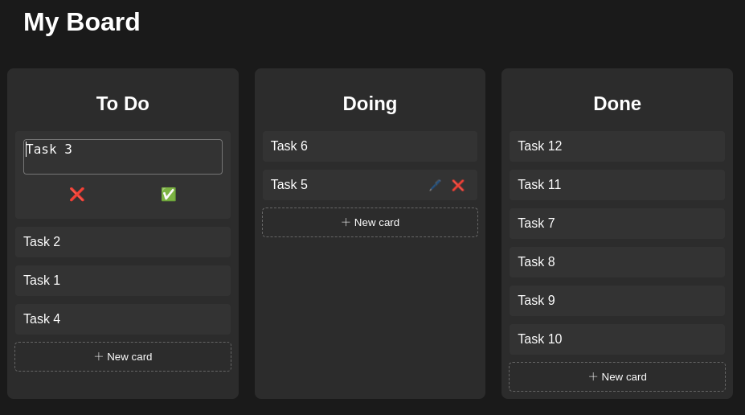

# Trello clone made with HTMX, hyperscript, Actix, Maud and SQLx

## Usage

I've made adaptations to make this very simple to build and run.

Execute `cargo run` and open http://localhost:5000/

## Features
- Creating, editing, deleting cards
- Moving cards between lists
- Reordering cards

## Notes

### Frontend

All of the frontend code was done using [htmx](htmx.org) and [\_hyperscript](https://hyperscript.org/), except for the drag and drop code

The only third party code is located in [static/DragDropTouch.js](static/DragDropTouch.js) which was copied from
[here](https://github.com/Bernardo-Castilho/dragdroptouch). This was only done to add mobile support

The implementation of the drag and drop on the tables is simple and very specific to this project. For a real project consider
using [Sortable](https://sortablejs.github.io/Sortable/), just like the [htmx docs](https://htmx.org/examples/sortable/) do
(writing drag and drop code really isn't as simple as I thought when I started this)

### Backend

All of the HTML generated in the backend was done using [maud](https://maud.lambda.xyz/)
- Pros
    * All the code is in the same place (all html generation was put into [html.rs](src/html.rs))
    * Static html generation code is embedded in the binary
- Cons
    * Compile times: every change in the hyperscript code or in the html requires a rebuild. Debugging isn't that great

The database I chose was SQLite (easy to use locally) with [sqlx](https://github.com/launchbadge/sqlx).
I was positively surprised when I found out I could use json functions inside SQLite which made it possible
to guarantee the safety on my transactions

[Actix](https://actix.rs/) was very nice to use specailly handling form data, which is always typed.
Helped to debug incorrect data being send from the frontend
